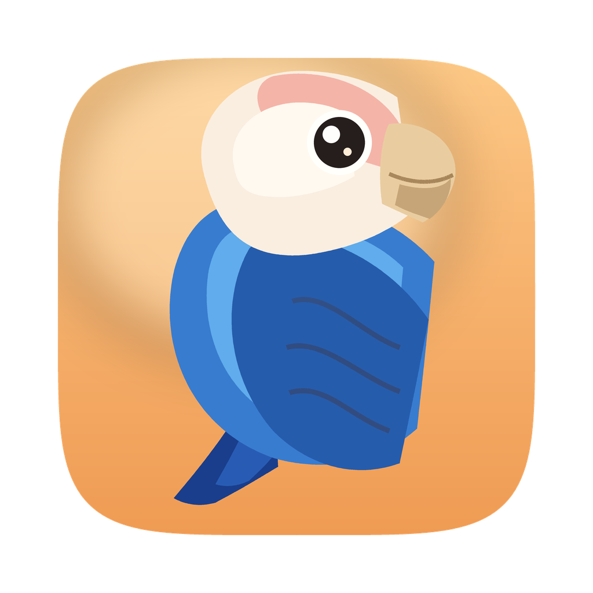

<p align="center">
  
</p>

<h1 align="center">TTY</h1>

<p align="center"><strong>贴图翻译 · macOS 屏幕翻译工具 · 全屏翻译 · 选区翻译 · 像素级原位覆盖</strong></p>

<p align="center">
  <a href="https://github.com/Archer-SQ/screen-translator/releases"></a>
  <a href="https://github.com/Archer-SQ/screen-translator/blob/main/LICENSE"></a>
  
  
</p>

<p align="center">
  <a href="https://github.com/kistCc/TTY/releases/latest">下载</a> · 
  <a href="https://github.com/Archer-SQ/screen-translator">上游项目</a>
</p>

---

## 关于本项目

本项目是 **[Archer-SQ/screen-translator](https://github.com/Archer-SQ/screen-translator)** 的修改版，
上游作者 **[@Archer-SQ](https://github.com/Archer-SQ)**，原项目以 MIT 许可证发布。
截图、OCR、翻译、像素级原位覆盖这套核心设计全部来自上游，在此致谢。

本仓库基于上游 v1.2.3，当前版本 v1.3.0。主要改动：

| 改动 | 说明 |
|---|---|
| **零权限全局快捷键** | 新增 `globalShortcut` 后端（macOS 上走 Carbon `RegisterEventHotKey`），普通组合键不再需要「输入监控」权限；只有和弦快捷键才回退到 CGEventTap |
| **修复状态机死锁** | 原生监听进程与 Electron 状态不同步，会导致快捷键按一次没反应、翻译失败后永久卡死 |
| **界面中文化** | 主进程提示条、托盘菜单、所有对话框；快捷键按 macOS 符号显示（⌥⌘T 而非 `alt+cmd+t`） |
| **隐私** | 关闭浮层即删除整屏截图，不再留在临时目录 |
| **更名 TTY** | 应用名与图标（蓝色牡丹鹦鹉）均为本分支自制 |
| **划词翻译** | `⌥D` 翻译当前选中的文本，结果显示在鼠标旁；优先走辅助功能接口，取不到时借剪贴板（菜单栏拷贝项优先于模拟按键），用完原样还回去 |
| **复制翻译** | `⌥C` 翻译剪贴板里的文本。和划词是两条互不回落的通道，按哪个键就翻哪来的文本 |
| **贴图复制** | 翻译浮层上 `⌘C` 复制整张贴图、`⇧⌘C` 复制译文；点击浮层即获得键盘焦点 |
| **启动不打扰** | 只驻留菜单栏，仅首次安装弹一次设置窗；可设为开机自启 |
| **全屏翻译提速** | 翻译批次并发、翻译前按文本去重、OCR 切图改用 JPEG |

完整改动见 commit 历史；第一个 commit 是上游 v1.2.3 的原始状态，可直接 diff。

---

## 这是什么？

一键翻译 macOS 屏幕上的任何文字 — 网页、应用、游戏、设置、错误提示，都能直接在原位置覆盖译文，像原生汉化一样。

两种模式：
- **全屏翻译**（`⌥⌘T`）— 按一下翻译整个屏幕
- **选区翻译**（`⌥⌘R`）— 拖拽框选，只翻译你关心的部分

> 快捷键可在设置里改。用普通组合键（修饰键 + 一个键）**不需要任何系统权限**；
> 若改成 `Shift+Z+X` 这类和弦，则需要授予「输入监控」。

## 特性

### 核心
- **两种翻译模式** — 全屏一键翻译 / 选区框选翻译
- **冻结截图** — 按下快捷键瞬间画面冻结，动态视频、游戏、动画也能精确框选
- **像素级原位覆盖** — Canvas 直接绘制，自动匹配字号和背景色，看起来像原生汉化
- **多屏支持** — 自动检测光标所在屏，翻译那一屏

### 浮层交互
- **任意位置可拖拽** — 不限于标题栏，整个浮层都能抓取移动
- **8 方向边缘缩放** — 窗口边缘鼠标自动切换 resize 光标
- **触控板双指捏合缩放** — 支持 Apple 触控板手势
- **双击关闭** — 简洁统一
- **常驻置顶** — 可覆盖全屏应用

### OCR & 翻译
- **2x2 象限分割 OCR** — 大屏截图切成 4 个重叠象限并行 OCR，精度更高
- **对比度增强预处理** — Core Image 改善低对比度文字（终端、dim UI）
- **Vision Revision 3** — 使用 macOS 最新 OCR 模型
- **多引擎** — Google（免费）/ OpenAI / Anthropic / DeepL / Ollama
- **翻译缓存** — `Shift+S` 手动保存，相同内容秒显
- **自动代理** — 自动读取 macOS 系统代理设置

### 隐私
- 所有处理在本地完成，截图不上传
- API 密钥仅存储在本地配置文件

## 安装

### 从 Release 下载

从 [Releases](https://github.com/kistCc/TTY/releases/latest) 下载最新 DMG，双击打开后拖入 Applications。

**首次打开提示「已损坏」？** 应用未经 Apple 签名，终端执行一次即可：
```bash
xattr -cr /Applications/TTY.app
```

### 从源码构建

```bash
git clone https://github.com/kistCc/TTY.git
cd TTY
npm install
npm run dev
```

本仓库只提交源码，`scripts/` 下的三个原生工具（OCR / 热键 / 辅助功能取词）是
Objective-C 源码，`npm run build` 会先用 clang 编译它们，再编译 TypeScript：

```bash
npm run build:native   # 只编译 scripts/*.m
npm run build          # 原生工具 + TypeScript
```

打包 .app / dmg：
```bash
npm run dist
```

### 系统要求

- macOS 13.0+（Apple Silicon）
- **屏幕录制** 权限（截图）
- **辅助功能** 权限（全局热键、UI 元素定位）

## 快捷键

| 快捷键 | 功能 |
|--------|------|
| `Shift + Z + X` | 全屏翻译 |
| `Shift + Z + C` | 选区翻译 |
| `ESC` | 关闭浮层 / 取消翻译 |
| `Shift + S` | 保存当前翻译到缓存 |

所有快捷键可在设置页面自定义。

## 翻译服务

| 服务 | API Key | 说明 |
|------|:---:|------|
| **Google 翻译** | 否 | 免费内置，自动代理 |
| **OpenAI 兼容** | 是 | GPT-4o-mini，支持自定义端点 |
| **Anthropic 兼容** | 是 | Claude、MiniMax 等 |
| **DeepL** | 是 | 欧洲语言高质量 |
| **Ollama** | 否 | 本地模型，完全离线 |

## 工作原理

```
快捷键 → 截屏 → OCR + AX 并行识别 → 过滤 → 分批翻译 → Canvas 绘制覆盖
```

**全屏翻译**：截整屏 → 2x2 象限分割 OCR → 合并去重 → 按行翻译 → 覆盖层渲染

**选区翻译**：先冻结整屏截图 → 弹出半透明选框 → 用户拖拽 → 裁剪截图 → OCR → 翻译 → 可拖拽可缩放的独立结果窗口

**关键技术**：
- macOS Vision framework OCR（zh-Hans / zh-Hant / ja / ko / en 等）
- 原生 CGEventTap 全局热键监听
- Canvas 直接绘制（自动字号反推、背景色采样、译文覆盖）
- Accessibility API 精确定位（配合 OCR 提升坐标精度）

## 项目结构

```
src/main/                主进程（TypeScript）
  index.ts               翻译流程编排
  screenshot.ts          区域截图（screencapture -R）
  ocr.ts                 调用 OCR 二进制 + 2x2 象限分割
  accessibility.ts       AX API 包装
  translator.ts          翻译服务调度
  providers/             google | openai | claude | deepl | ollama
  overlay.ts             全屏覆盖层窗口管理
  region-overlay.ts      选区结果浮层管理（可拖拽可缩放，可多开）
  selection.ts           选区绘制窗口（冻结截图背景）
  hotkey.ts              原生热键进程管理
  tray.ts                系统托盘菜单

src/renderer/            渲染层（纯 HTML/JS）
  overlay.html/js        Canvas 绘制全屏覆盖层
  region-overlay.html/js 选区结果浮层
  selection.html/js      选区框选 UI
  settings.html/js       设置页面（中英双语）

scripts/                 原生 macOS 工具（Objective-C）
  ocr-macos.m            Vision OCR + Core Image 对比度增强
  hotkey-macos.m         CGEventTap 全局热键
  axtext-macos.m         Accessibility 文字读取
```

## 开源协议

MIT

## 致谢

- [google-translate-api-x](https://github.com/AidanWelch/google-translate-api) — 免费 Google 翻译
- [Electron](https://www.electronjs.org/) — 桌面应用框架
- Apple Vision Framework — 原生 OCR
