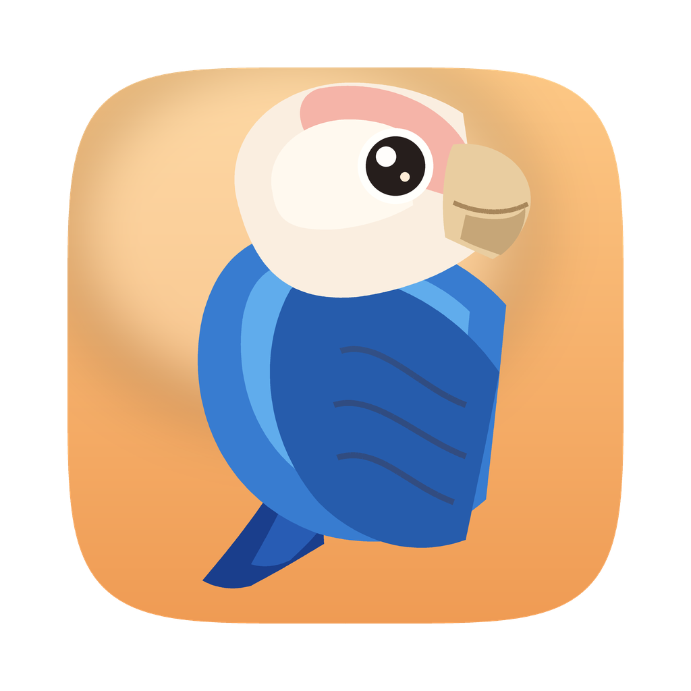
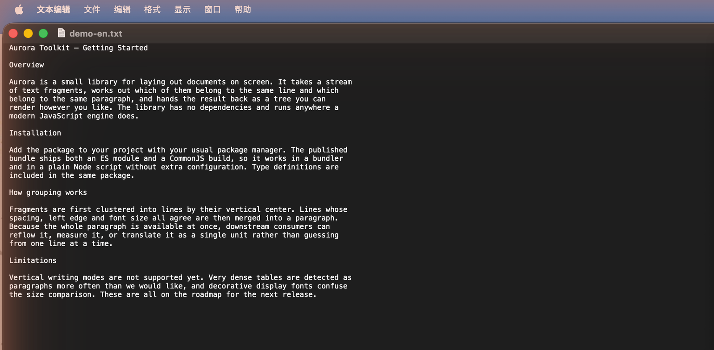
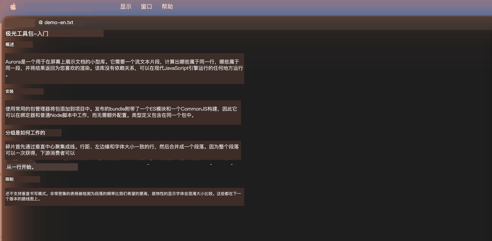

<p align="center">
  
</p>

<h1 align="center">TTY</h1>

<p align="center"><strong>贴图翻译 · macOS 屏幕翻译工具 · 全屏翻译 · 选区翻译 · 像素级原位覆盖</strong></p>

<p align="center">
  <a href="https://github.com/kistCc/TTY/releases/latest"></a>
  <a href="https://github.com/kistCc/TTY/blob/main/LICENSE"></a>
  
  
</p>

<p align="center">
  <a href="https://github.com/kistCc/TTY/releases/latest">下载</a> · 
  <a href="https://github.com/Archer-SQ/screen-translator">上游项目</a>
</p>

---

## 关于本项目

本项目是 **[Archer-SQ/screen-translator](https://github.com/Archer-SQ/screen-translator)** 的修改版，
上游作者 **[@Archer-SQ](https://github.com/Archer-SQ)**，原项目以 MIT 许可证发布。
截图、OCR、翻译、像素级原位覆盖这套核心设计全部来自上游，在此致谢。

本仓库基于上游 v1.2.3，当前版本 v1.5.0。主要改动：

- **快捷键与稳定性** — 普通组合键不再需要「输入监控」权限；修好快捷键没反应、翻译失败后卡死；只认设置里的关闭键
- **界面中文化** — 提示条、托盘菜单、对话框全部中文，快捷键按 macOS 符号显示
- **新功能** — 划词翻译（`⌥D`）、输入翻译（`⌥C`）、贴图复制（`⌘C` / `⇧⌘C`）、按住看原文
- **识别更准** — 整屏分块找字、按区域放大重认；深色页面不漏字；日文、韩文按对应语言重认
- **翻译更准** — 整段翻译整段覆盖；代码、网址、产品名不翻；常见界面词固定译法；保持原文颜色
- **贴图更干净** — 只擦字形，图标、徽章、标签横线保留；字号跟着原文走
- **翻译引擎** — 新增有道（免费）、Apple 翻译（免费，离线）；各家服务统一分批、失败保留原文
- **隐私与打扰** — 关闭浮层即删截图；只驻留菜单栏；应用更名 TTY、自制图标

每一项的细节见 [docs/改动详情.md](docs/改动详情.md)。

---

## 这是什么？

一键翻译 macOS 屏幕上的任何文字 — 网页、应用、游戏、设置、错误提示，都能直接在原位置覆盖译文，像原生汉化一样。

两种模式：
- **全屏翻译**（`⌥⌘T`）— 按一下翻译整个屏幕
- **选区翻译**（`⌥⌘R`）— 拖拽框选，只翻译你关心的部分

> 快捷键可在设置里改。用普通组合键（修饰键 + 一个键）**不需要任何系统权限**；
> 若改成 `Shift+Z+X` 这类和弦，则需要授予「输入监控」。

### 实际效果

按一下 `⌥⌘T`，整屏英文原位变中文——段落整段翻译、整段折行贴回原来的位置，排版不变：

| 翻译前 | 翻译后 |
|---|---|
|  |  |

> 图中第三段中间那条空白是故意的：那一行 OCR 只认出半个字高、内容已经是乱码，
> 与其贴一行错字，不如把原文盖掉留白。

## 特性

### 核心
- **两种翻译模式** — 全屏一键翻译 / 选区框选翻译
- **冻结截图** — 按下快捷键瞬间画面冻结，动态视频、游戏、动画也能精确框选
- **像素级原位覆盖** — Canvas 直接绘制，自动匹配字号、背景色和字色（链接、高亮的词保留原来的颜色和下划线），看起来像原生汉化
- **多屏支持** — 自动检测光标所在屏，翻译那一屏

### 浮层交互
- **任意位置可拖拽** — 不限于标题栏，整个浮层都能抓取移动
- **8 方向边缘缩放** — 窗口边缘鼠标自动切换 resize 光标
- **触控板双指捏合缩放** — 支持 Apple 触控板手势
- **按设置的关闭键关闭** — 不响应双击，也不认没设置过的键
- **看得出贴图在哪** — 区域贴图带系统窗口阴影；没选中时边缘一圈灰色细线，选中（能收按键）时变成淡紫色；翻译后默认自动选中（可在设置里关）
- **按住看原文** — 默认按住空格，松开回到译文
- **常驻置顶** — 可覆盖全屏应用

### OCR & 翻译
- **分块识别 + 版面重建** — 整屏分格子找字、按区域放大重认，再按行距/左边缘/字号/底色把文本块还原成段落，整段翻译整段覆盖
- **Vision Revision 3** — 使用 macOS 最新 OCR 模型
- **多引擎** — Google（免费）/ 有道（免费）/ Apple 翻译（免费，离线，macOS 26.4 起）/ OpenAI / Anthropic / DeepL / Ollama
- **翻译缓存** — `Shift+S` 手动保存，相同内容秒显
- **自动代理** — 自动读取 macOS 系统代理设置

### 隐私
- 所有处理在本地完成，截图不上传
- API 密钥仅存储在本地配置文件

## 安装

### 从 Release 下载

从 [Releases](https://github.com/kistCc/TTY/releases/latest) 下载最新 DMG，双击打开后拖入 Applications。

**首次打开提示「已损坏」？** 应用未经 Apple 签名，终端执行一次即可：
```bash
xattr -cr /Applications/TTY.app
```

### 权限说明

TTY 用到两个系统权限，都在「系统设置 → 隐私与安全性」里开：

| 权限 | 管什么 | 没开会怎样 |
|---|---|---|
| **录屏与系统录音**（屏幕录制） | 截屏翻译、区域翻译 | 截不到屏幕内容 |
| **辅助功能** | 划词翻译（读取选中的文本）、界面元素定位 | 划词提示「取不到选中的文本」，并给出授权入口 |

第一次用到时 TTY 会提示你去开。**开关已经打开还是不行**（多见于升级之后）：在列表里选中 TTY 点「−」删掉，再点「+」把 `/Applications/TTY.app` 加回来、打开开关，然后重新打开 TTY。

发布版每一版都用同一张证书签名，升级后授权会保留，一般只需要授权一次。
（从 1.4.0 起启用固定签名；从更早的版本升级上来时需要按上面的办法重新授权一次。）

### 遇到问题时打开排查日志

在终端执行下面这行，然后重现一次问题：
```bash
mkdir -p ~/Library/Logs/TTY && touch ~/Library/Logs/TTY/tty-debug.log
```
日志会写进这个文件（也可以在系统自带的「控制台」App →「日志报告」里看到），把它附在 Issue 里。排查完删掉这个文件就关了。

### 从源码构建

```bash
git clone https://github.com/kistCc/TTY.git
cd TTY
npm install
npm run dev
```

本仓库只提交源码，`scripts/` 下的原生工具（OCR / 热键 / 辅助功能取词是 Objective-C，
Apple 翻译是 Swift），`npm run build` 会先用 clang 和 swiftc 编译它们，再编译 TypeScript：

```bash
npm run build:native   # 只编译 scripts/ 下的原生工具
npm run build          # 原生工具 + TypeScript
```

打包 .app / dmg：
```bash
npm run dist
```

自己从源码打包的版本没有固定签名（发布用的证书不在仓库里），每次重新打包后都要按「权限说明」重新授权一次。
想避免这一点，可以自己建一张代码签名证书，打包前设置环境变量 `TTY_SIGN_ID`（证书的 SHA-1），
`scripts/after-pack.js` 会用它签名。

### 系统要求

- macOS 13.0+（Apple Silicon）
- **屏幕录制** 权限（截图）
- **辅助功能** 权限（划词翻译、UI 元素定位）

详见上面的「权限说明」。

## 快捷键

| 快捷键 | 功能 |
|--------|------|
| `⌥⌘T` | 全屏翻译 |
| `⌥⌘R` | 选区翻译 |
| `⌥D` | 划词翻译（翻译当前选中的文本） |
| `⌥C` | 输入翻译（弹出输入框，回车翻译） |
| `ESC` | 关闭浮层 / 贴图 / 小窗，取消框选 / 翻译 |
| `⌘C` / `⇧⌘C` | 贴图上复制整张贴图 / 复制译文 |
| 按住 `空格` | 贴图上看原文 |
| `⇧S` | 保存当前翻译到缓存 |

以上是默认值，全部可在设置页面自定义。默认这套是普通组合键，不需要任何系统权限。

## 翻译服务

| 服务 | API Key | 说明 |
|------|:---:|------|
| **Google 翻译** | 否 | 免费内置，自动代理；支持保持原文颜色；英文句子里夹着中文（文件路径、中文名词）也能翻，夹着的中文原样保留 |
| **有道翻译** | 否 | 免费内置，走网页版接口，国内直连；不支持保持原文颜色 |
| **Apple 翻译** | 否 | 免费、离线，macOS 自带翻译（需 macOS 26.4 起，先在系统设置下载语言）；长句通顺，界面短词不如有道 |
| **OpenAI 兼容** | 是 | GPT-4o-mini，支持自定义端点 |
| **Anthropic 兼容** | 是 | Claude、MiniMax 等 |
| **DeepL** | 是 | 欧洲语言高质量 |
| **Ollama** | 否 | 本地模型，完全离线 |

## 工作原理

```
快捷键 → 截屏 → 分块找字 + 按区域放大重认 → 过滤坏块和不该翻的 → 聚行并段 → 分批翻译 → Canvas 擦除原文并绘制译文
```

**全屏翻译**：截整屏 → 分块识别 → 剔除坏块 → 聚行并段 → 整段翻译 → 覆盖层擦除原文并折行绘制

**选区翻译**：先冻结整屏截图 → 弹出半透明选框 → 用户拖拽 → 裁剪截图 → OCR → 翻译 → 可拖拽可缩放的独立结果窗口

**关键技术**：
- macOS Vision framework OCR（zh-Hans / zh-Hant / ja / ko / en 等）
- 原生 CGEventTap 全局热键监听
- Canvas 直接绘制（自动字号反推、背景色采样、译文覆盖）

## 项目结构

```
src/main/                主进程（TypeScript）
  index.ts               翻译流程编排
  screenshot.ts          区域截图（screencapture -R）
  pipeline.ts            一张截图从识别到可绘制数据（全屏、区域共用）
  layout.ts              版面重建：过滤、聚行、并段，判断代码/标识/logo
  ocr.ts                 调用 OCR 原生程序
  ink.ts                 字色：定主色、挑出色段、翻译标记的包裹与还原
  translator.ts          翻译服务调度（含文本去重）
  batch.ts               批次切分与并发调度
  providers/             google | youdao | apple | openai | claude | deepl | ollama
  quick.ts               划词翻译的小窗
  input.ts               输入翻译的输入框
  front-app.ts           记下 / 还原原来在前台的软件
  selection-text.ts      取当前选中文本（AX 优先，必要时借剪贴板）
  native.ts              原生工具的编译与调用
  http.ts                请求封装（原始文本 / JSON）
  overlay.ts             全屏覆盖层窗口管理
  region-overlay.ts      选区结果浮层管理（可拖拽可缩放，可多开）
  selection.ts           选区绘制窗口（冻结截图背景）
  hotkey.ts              原生热键进程管理
  tray.ts                系统托盘菜单

src/renderer/            渲染层（纯 HTML/JS）
  overlay.html/js        Canvas 绘制全屏覆盖层
  region-overlay.html/js 选区结果浮层
  selection.html/js      选区框选 UI
  settings.html/js       设置页面（中英双语）

scripts/                 原生 macOS 工具（Objective-C / Swift）
  ocr-macos.m            Vision OCR：分块找字、按区域放大重认，按词量字色、认下划线
  hotkey-macos.m         CGEventTap 全局热键
  axtext-macos.m         Accessibility 文字读取
  translate-macos.swift  系统翻译（Translation 框架，离线）
```

## 开源协议

MIT

## 致谢

- [google-translate-api-x](https://github.com/AidanWelch/google-translate-api) — 免费 Google 翻译
- [Electron](https://www.electronjs.org/) — 桌面应用框架
- Apple Vision Framework — 原生 OCR

## 贡献者

| | |
|---|---|
| [@kistCc](https://github.com/kistCc) | 本分支维护 |
| [@Archer-SQ](https://github.com/Archer-SQ) | 上游 [screen-translator](https://github.com/Archer-SQ/screen-translator) 作者 |
| [Claude](https://claude.com/claude-code)（Anthropic） | v1.3.x 的有道翻译接入、全屏整段翻译重构、图标与文档，v1.4.0 的保持原文颜色，v1.5.0 的识别与绘制改造，由 Claude 结对完成 |
